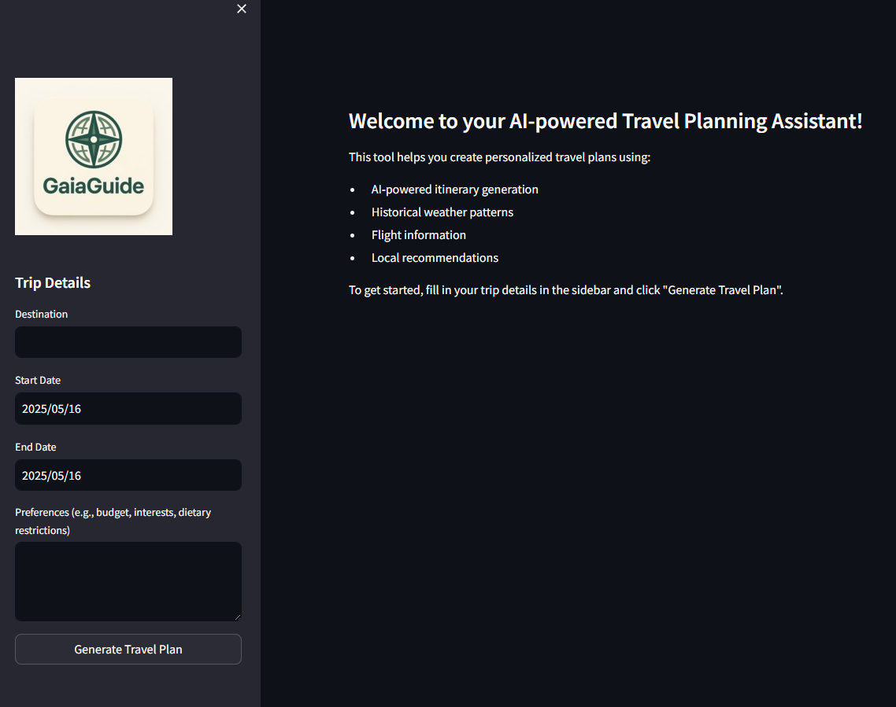
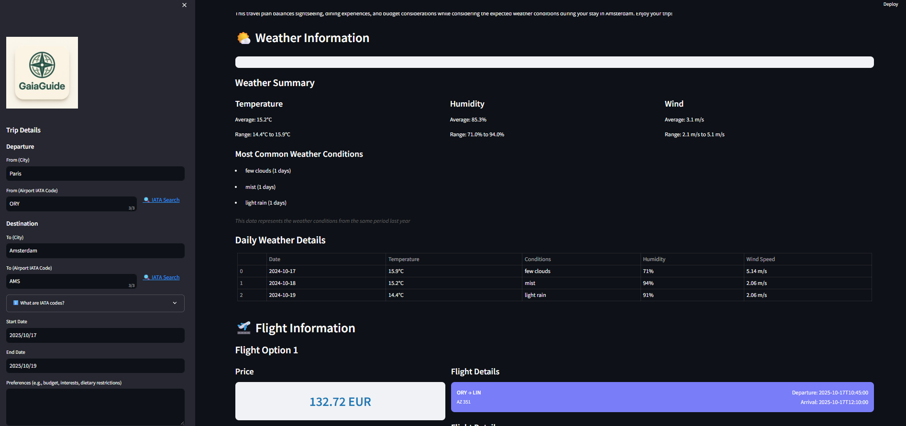

# Travel Planning Assistant

An AI-powered web application that helps users create personalized travel plans using Streamlit and OpenAI's GPT model. The application provides comprehensive travel planning assistance, including itinerary generation, weather forecasts, and flight information.

## Demo

Try out the live demo at: [http://138.201.89.207:8501/](http://138.201.89.207:8501/)

### Application Screenshots

#### Initial UI


#### Active Results View


The application provides a user-friendly interface where you can:
1. Enter your travel details in the sidebar
2. Get personalized travel recommendations
3. View detailed flight options with pricing
4. See weather forecasts for your destination
5. Receive a comprehensive travel plan

## Features

- 🤖 AI-powered travel itinerary generation
- 🌤️ Weather forecast integration (via dedicated weather service)
- ✈️ Flight information lookup
- 📅 Date-based planning
- 🎯 Personalized recommendations based on user preferences
- 💰 Budget considerations
- 🍽️ Dining recommendations
- 🚗 Local transportation options

## Prerequisites

- Python 3.7 or higher
- OpenAI API key
- OpenWeather API key
- Docker and Docker Compose

## Installation

1. Clone the repository:
```bash
git clone https://github.com/yourusername/travel-planning-assistant.git
cd travel-planning-assistant
```

2. Create a `.env` file in the project root and add your API keys:
```
OPENAI_API_KEY=your_openai_api_key_here
OPENWEATHER_API_KEY=your_openweather_api_key_here
```

3. Start the application using Docker Compose:
```bash
docker-compose up --build
```

## Usage

1. Open your web browser and navigate to `http://localhost:8501`

2. Use the sidebar to input your travel details:
   - Destination
   - Start Date
   - End Date
   - Preferences (budget, interests, dietary restrictions)

3. Click "Generate Travel Plan" to create your personalized itinerary

## Project Structure

```
travel-planning-assistant/
├── app.py              # Main application file
├── requirements.txt    # Python dependencies
├── Dockerfile         # Docker configuration
├── docker-compose.yml # Docker Compose configuration
├── .env              # Environment variables (create this)
├── .dockerignore     # Docker ignore file
├── .gitignore        # Git ignore file
├── LICENSE           # Project license
├── images/           # Static images and assets
├── weather_service/  # Weather microservice
│   ├── app.py       # Weather service implementation
│   ├── requirements.txt
│   └── Dockerfile
├── flight_service/   # Flight information microservice
│   ├── app.py       # Flight service implementation (in development)
│   ├── requirements.txt
│   └── Dockerfile
└── README.md         # This file
```

## Services

### Main Application
- Streamlit-based web interface
- Handles user interactions and travel planning
- Communicates with weather and flight services

### Weather Service
- FastAPI-based microservice
- Provides real-time weather data
- Uses OpenWeather API for weather information

### Flight Service
- FastAPI-based microservice (in development)
- Will provide flight information and booking capabilities
- Planned integration with flight booking APIs

## Dependencies

### Main Application
- streamlit==1.32.0
- openai>=1.12.0
- python-dotenv==1.0.1
- requests==2.31.0
- pandas==2.2.1
- python-dateutil==2.8.2

### Weather Service
- fastapi==0.109.2
- uvicorn==0.27.1
- requests==2.31.0
- python-dotenv==1.0.1
- pydantic==2.6.1

## Contributing

Contributions are welcome! Please feel free to submit a Pull Request.

## License

This project is licensed under the terms of the license included in the repository.

## Acknowledgments

- OpenAI for providing the GPT API
- OpenWeather for weather data
- Streamlit for the web application framework
- FastAPI for the microservices
- All contributors who have helped improve this project 